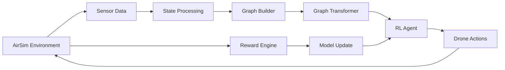
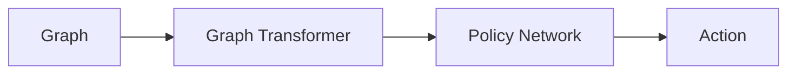
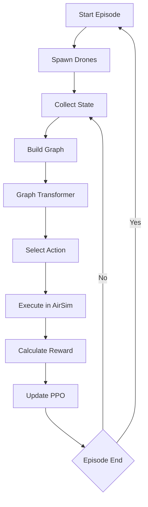
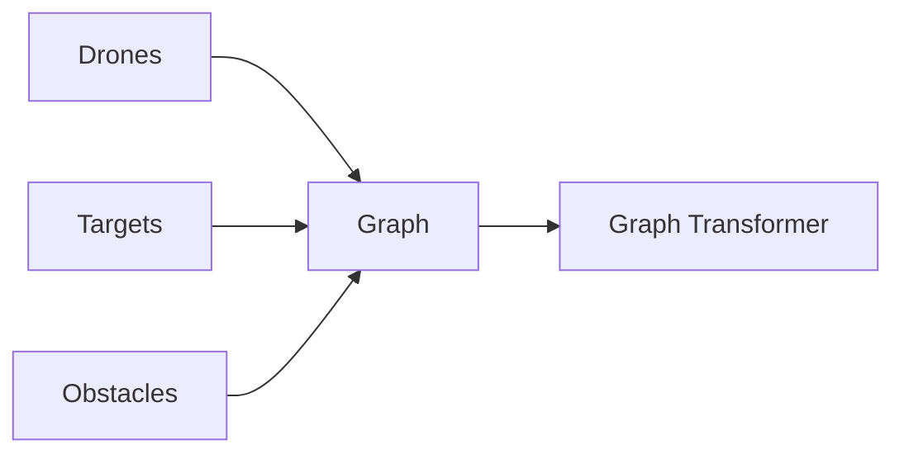
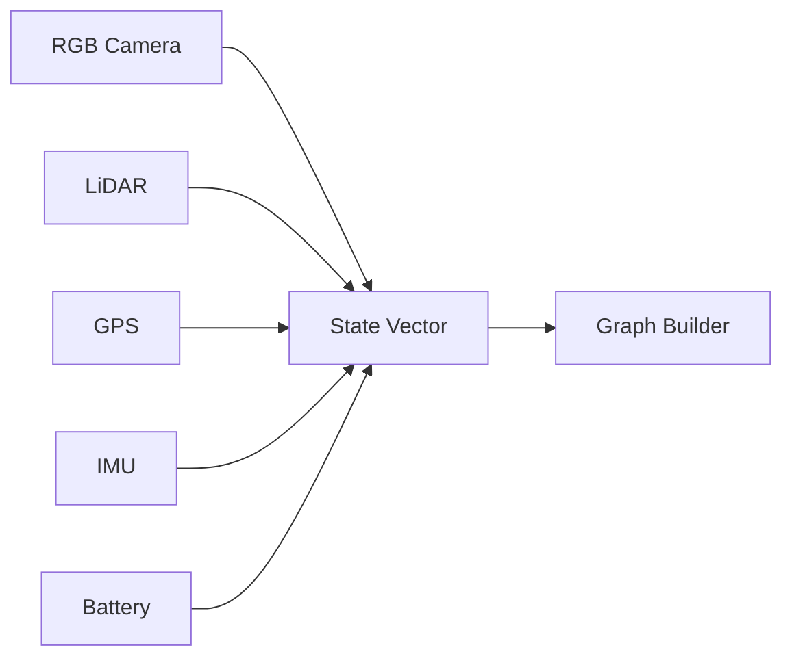

# Graph Transformer Multi-Agent Reinforcement Learning for UAV Navigation


> **Note on project status:** This repository currently contains the research design, system architecture, and planning documentation for the project described below. It does **not** yet contain a trained model or a complete working pipeline. Every section below is explicitly labeled as **Current**, **Planned**, or **Future Work** so that readers know exactly what exists today versus what is designed but not yet built.

---

## Table of Contents

1. [Introduction](#1-introduction)
2. [Problem Statement](#2-problem-statement)
3. [Research Motivation](#3-research-motivation)
4. [Research Gap](#4-research-gap)
5. [Objectives](#5-objectives)
6. [Proposed Solution](#6-proposed-solution)
7. [Overall Architecture](#7-overall-architecture)
8. [Workflow](#8-workflow)
9. [Technology Stack](#9-technology-stack)
10. [Directory Structure](#10-directory-structure)
11. [Installation](#11-installation)
12. [Usage](#12-usage)
13. [Training Pipeline](#13-training-pipeline)
14. [Reward Function](#14-reward-function)
15. [Graph Construction](#15-graph-construction)
16. [Multi-Agent Coordination](#16-multi-agent-coordination)
17. [Evaluation Metrics](#17-evaluation-metrics)
18. [Future Work](#18-future-work)

---

## 1. Introduction

This project proposes a **Graph Transformer-based Multi-Agent Reinforcement Learning (MARL) framework** for cooperative unmanned aerial vehicle (UAV) navigation. Multiple drones, obstacles, and mission targets are represented as a dynamic graph, which is processed by a Graph Transformer to reason about spatial relationships between agents before a reinforcement learning policy selects navigation actions. A distinguishing goal of the project is **interpretability**: the attention weights produced by the Graph Transformer are intended to be exposed as human-readable explanations of *why* a given navigation decision was made, rather than treating the policy as a black box.

The intended audience for this repository includes recruiters and hiring managers evaluating applied ML/robotics work, professors and thesis committees assessing research contribution and rigor, and AI/robotics researchers interested in the graph-based coordination design.

## 2. Problem Statement

Existing UAV navigation systems perform well in static or moderately dynamic environments but often struggle with **scalable multi-agent coordination**, **changing environments**, and **interpretable decision making**. Most deep reinforcement learning methods rely on local observations and provide limited insight into why a navigation decision was made.

This project proposes a Graph Transformer-based Multi-Agent Reinforcement Learning framework capable of learning cooperative navigation policies while producing interpretable, attention-based explanations of agent interactions.

## 3. Research Motivation

Multi-drone systems are increasingly used in search-and-rescue, agricultural monitoring, warehouse logistics, and surveillance. As fleet sizes grow, two problems become critical:

- **Coordination complexity** — the number of pairwise interactions between drones and obstacles grows combinatorially, and fixed-size input representations (e.g., flattened state vectors fed to an MLP, or grid representations fed to a CNN) do not naturally scale to a variable number of agents.
- **Decision opacity** — deep RL policies are typically evaluated only on aggregate success metrics. In safety-relevant domains like autonomous flight, understanding *why* a policy chose a maneuver (e.g., which neighboring drone or obstacle influenced the decision) is important for debugging, trust, and certification.

A graph-based representation combined with attention mechanisms is a natural fit for both problems: graphs handle a variable number of agents/obstacles without architectural changes, and attention weights offer a built-in, inspectable signal for explainability.

## 4. Research Gap

| Existing Approach | Limitation |
|---|---|
| CNN + PPO on image/grid observations | Fixed input size; does not scale cleanly to variable numbers of agents; spatial relationships between distant agents are hard to capture |
| MLP + PPO on flattened state vectors | No explicit relational structure; performance degrades as the number of agents grows |
| Graph Neural Network (GNN) + PPO | Captures relational structure, but standard message-passing GNNs have limited long-range/global attention and typically offer weaker built-in interpretability than attention-based models |
| Most MARL navigation research | Rarely combines relational graph reasoning **and** an explicit explainability layer in the same system |

The gap this project targets is the **combination** of (a) graph-based relational reasoning via a Transformer's attention mechanism and (b) a dedicated explainability layer, evaluated systematically against the baselines above — rather than any single one of these components in isolation.

## 5. Objectives

- Build a realistic multi-drone simulation in AirSim.
- Represent drones and obstacles as a dynamic graph.
- Use a Graph Transformer for relational reasoning.
- Train policies with reinforcement learning.
- Add an explainability layer using attention analysis.
- Compare against standard PPO/CNN baselines.

## 6. Proposed Solution

The proposed system converts raw multi-drone sensor observations into a graph where nodes represent drones, obstacles, and targets, and edges represent spatial or relational proximity. A **Graph Transformer** encodes this graph into relational embeddings, which are consumed by a **PPO-based policy network** to select navigation actions for each drone. Attention weights from the Graph Transformer are logged and surfaced through an **explainability module** so that individual decisions can be traced back to the agents or obstacles that most influenced them.

**Why this design?**

| Decision | Reason |
|---|---|
| Graph representation instead of raw image/grid | Naturally supports a variable number of drones/obstacles without retraining or resizing the network |
| Graph Transformer instead of a standard GNN | Self-attention allows any node to directly attend to any other node (not just local neighbors after k hops), and attention weights are a natural interpretability signal |
| PPO as the RL algorithm | PPO is a stable, well-understood on-policy algorithm with strong empirical performance in continuous-control and robotics tasks, making it a reasonable and reproducible starting point before exploring more specialized MARL algorithms |
| Separate explainability module | Decoupling explanation generation from the policy network keeps the policy simple to train while still producing decision transparency as a post-hoc analysis layer |
| AirSim as the simulator | Provides photorealistic, physics-based multi-drone simulation with sensor models (RGB, LiDAR, GPS, IMU), avoiding the cost and risk of real hardware during early development |

## 7. Overall Architecture



The environment produces sensor data, which is processed into a state representation and then into a graph. The Graph Transformer encodes the graph, the RL agent selects actions from that encoding, and actions are executed back in the environment, closing the loop. In parallel, the environment produces reward signals that update the policy.

### Decision Flow (high level)



**Why this separation?** Splitting "graph representation," "relational reasoning," and "policy decision" into distinct stages keeps each component independently testable — the Graph Transformer can be evaluated on relational tasks in isolation from the RL policy, and the policy network can be swapped (e.g., PPO vs. another algorithm) without changing the perception/representation stack.

## 8. Workflow



Each episode spawns a fresh set of drones, then repeatedly collects state, builds a graph, runs the Graph Transformer, selects an action, executes it in AirSim, computes reward, and updates PPO — looping until the episode ends.

## 9. Technology Stack

| Layer | Technology | Status |
|---|---|---|
| Simulation | Microsoft AirSim | Planned |
| Programming Language | Python 3.10+ | Planned |
| Deep Learning Framework | PyTorch | Planned |
| Graph Neural Network / Attention Layers | PyTorch Geometric or a custom Graph Transformer implementation | Planned |
| Reinforcement Learning | PPO (e.g., via Stable-Baselines3 or a custom implementation) | Planned |
| Explainability | Custom attention-visualization tooling | Planned |
| Experiment Tracking | TBD (e.g., Weights & Biases or TensorBoard) | Future consideration |

> The stack above reflects the intended technologies based on the project design. No dependency has been locked in with a working implementation yet — see [Installation](#11-installation).

## 10. Directory Structure

The structure below reflects the **planned** module breakdown. It has not yet been implemented as actual code in this repository.

```
project-root/
├── airsim_interface/        # Module 1: mission launch, drone spawning, sensor acquisition, command execution
├── state_processing/        # Module 2: raw observations -> graph nodes/edges, occupancy representation
├── graph_transformer/       # Module 3: core research contribution — relational reasoning model
├── rl_engine/                # Module 4: PPO (or alternative), replay buffers, policy/value updates
├── explainability/            # Module 5: attention heatmaps, influential-neighbor analysis, decision explanations
├── evaluation/                # Module 6: baseline comparisons and metric computation
├── configs/                   # Planned: experiment/config files
├── notebooks/                  # Planned: analysis and visualization notebooks
└── README.md
```

## 11. Installation

> **Status: Planned.** No installable package or `requirements.txt` currently exists in this repository. The steps below describe the intended setup once the environment is implemented.

```bash
# 1. Clone the repository
git clone https://github.com/<your-username>/<your-repo>.git
cd <your-repo>

# 2. Create a virtual environment
python -m venv venv
source venv/bin/activate  # on Windows: venv\Scripts\activate

# 3. Install dependencies (planned)
pip install -r requirements.txt

# 4. Install and configure AirSim separately
# See: https://microsoft.github.io/AirSim/
```

## 12. Usage

> **Status: Planned.** The commands below describe the intended usage once training and evaluation scripts exist; they are not runnable yet.

```bash
# Launch AirSim environment (external step, not part of this repo)

# Train the Graph Transformer + PPO agent (planned entry point)
python train.py --config configs/default.yaml

# Evaluate a trained policy against baselines (planned entry point)
python evaluate.py --checkpoint checkpoints/model.pt
```

## 13. Training Pipeline

The training loop follows the [Workflow](#8-workflow) diagram above:

1. **Start episode** and spawn drones in AirSim.
2. **Collect state** from onboard sensors.
3. **Build graph** from the current state (see [Graph Construction](#15-graph-construction)).
4. **Run the Graph Transformer** to produce relational embeddings.
5. **Select an action** per drone via the policy network.
6. **Execute actions** in AirSim and observe the result.
7. **Compute reward** (see [Reward Function](#14-reward-function)).
8. **Update PPO** using collected trajectories.
9. Repeat until the episode ends, then start a new episode.

**Status: Planned.** This describes the intended training loop; no training run has been executed yet in this repository.

## 14. Reward Function

**Status: Planned — not yet finalized.** The reward function has not been implemented or precisely specified. Based on the evaluation metrics identified for the project (see [Evaluation Metrics](#17-evaluation-metrics)), the reward is expected to combine multiple objectives, such as:

- Progress toward the mission target
- Penalty for collisions with obstacles or other drones
- Penalty for excessive energy consumption
- Bonus for successful mission completion

The exact weighting and shaping of these terms is future design work and will be documented here once finalized, to avoid overstating what has been decided.

## 15. Graph Construction



Drones, targets, and obstacles are combined into a single graph, which is then passed into the Graph Transformer.

The state vector feeding into the graph builder is intended to be assembled from multiple onboard sensors:



**Why a multi-sensor fusion approach?** No single sensor is sufficient on its own — RGB provides semantic/visual context, LiDAR provides accurate spatial/depth information, GPS provides absolute positioning, IMU provides motion/orientation, and battery level is needed for energy-aware decision making. Fusing them into one state vector before graph construction keeps the downstream graph-building logic sensor-agnostic.

**Status: Planned.** The specific rule for what constitutes a graph edge (e.g., distance threshold, k-nearest-neighbors, or line-of-sight) has not yet been finalized or implemented.

## 16. Multi-Agent Coordination

Coordination between drones is intended to emerge from the Graph Transformer's self-attention mechanism: each drone node can attend to every other drone and obstacle node in the graph, allowing the policy to implicitly learn cooperative behaviors (e.g., collision avoidance, task allocation, formation-like spacing) without hand-coded coordination rules.

**Why attention-based coordination instead of hand-crafted coordination logic?** Hand-crafted rules (e.g., fixed formations or manually defined communication protocols) do not generalize well to unseen numbers of agents or novel obstacle layouts. An attention mechanism learns which relationships matter directly from data and naturally supports a variable number of agents.

**Status: Planned.** No multi-agent training experiments have been run yet; this section describes the intended mechanism, not a demonstrated result.

## 17. Evaluation Metrics

The proposed Graph Transformer + PPO approach is intended to be compared against the following baselines:

| Baseline |
|---|
| CNN + PPO |
| MLP + PPO |
| Graph Neural Network + PPO |
| Graph Transformer + PPO (proposed) |

Using the following metrics:

| Metric | What it measures |
|---|---|
| Mission success rate | Fraction of episodes where all drones reach their targets without failure |
| Path length | Efficiency of the navigation path taken |
| Collision rate | Safety — frequency of collisions with obstacles or other drones |
| Energy consumption | Efficiency of the flight policy |
| Completion time | Speed of mission execution |
| Inference latency | Real-time feasibility of the policy |
| Generalization to unseen maps | Robustness of the learned policy to novel environments |

**Status: Planned.** No baseline has been trained or evaluated yet; this table defines the intended evaluation protocol.

## 18. Future Work

Beyond the core planned implementation described above, the following directions are identified as future work, roughly in order of expected research value:

- **Multi-environment evaluation** — testing across multiple distinct simulated environments rather than a single map, to assess robustness.
- **Cross-scenario transfer** — demonstrating transfer of a trained policy across different mission types (e.g., search-and-rescue vs. patrol), since cross-scenario robustness remains an open challenge in graph-based navigation research.
- **Improved generalization benchmarking** — systematic comparison of generalization to unseen maps against existing graph-based methods, not just the internal baselines listed above.
- **Real-hardware validation** — evaluating whether policies trained in AirSim transfer to physical drone hardware (sim-to-real transfer).
- **Richer explainability outputs** — extending beyond attention heatmaps to more structured, human-readable decision explanations.

---

### Project Novelty Self-Assessment

For transparency, an internal novelty self-assessment was used to guide scope decisions during planning:

| Scope | Self-assessed novelty |
|---|---|
| AirSim + PPO only | 3 / 10 |
| AirSim + Graph Transformer | 7 / 10 |
| + Explainability, evaluated across multiple environments | 8.5 / 10 |

This assessment reflects internal planning judgment, not a peer-reviewed evaluation, and is included here for transparency about how the project's scope was decided.
