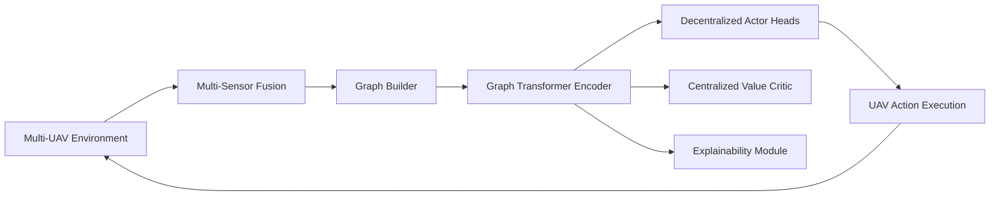
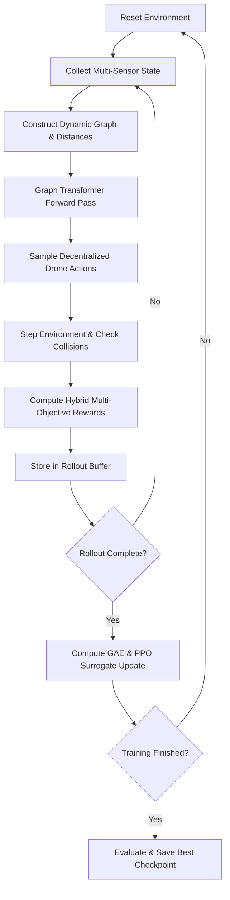

# Graph Transformer Multi-Agent Reinforcement Learning for UAV Navigation


A multi-agent reinforcement learning (MARL) framework for cooperative unmanned aerial vehicle (UAV) navigation in dynamic 3D environments. Drones, obstacles, and targets are modeled as a dynamic spatial graph processed by a **Graph Transformer with Continuous Distance-Biased Soft Masking**. A Centralized Training with Decentralized Execution (CTDE / MAPPO) policy controls multi-drone navigation while exposing multi-head attention weights for interpretability and post-hoc decision explainability.

---

## Table of Contents

1. [Overview](#1-overview)
2. [Key Architecture Components](#2-key-architecture-components)
3. [Workflow](#3-workflow)
4. [Technology Stack](#4-technology-stack)
5. [Directory Structure](#5-directory-structure)
6. [Installation](#6-installation)
7. [Usage & Training](#7-usage--training)
8. [Evaluation & Baseline Comparison](#8-evaluation--baseline-comparison)
9. [Explainability & Attention Visualization](#9-explainability--attention-visualization)
10. [Benchmark Metrics](#10-benchmark-metrics)
11. [Testing](#11-testing)

---

## 1. Overview

Autonomous multi-UAV navigation in congested or obstacle-rich 3D airspaces presents significant coordination and safety challenges. Traditional methods using flattened vectors (MLP) or fixed-resolution grids (CNN) do not scale seamlessly to varying fleet sizes and dynamic obstacle counts.

This framework solves these challenges through:
- **Dynamic Graph Representation**: Variable numbers of drones, obstacles, and targets are encoded as nodes in a unified spatial graph.
- **Relational Reasoning via Graph Transformer**: Nodes communicate via multi-head self-attention with continuous logarithmic distance biases ($-\gamma \cdot \log(1 + d_{ij})$), preventing node isolation while prioritizing local interactions.
- **CTDE (MAPPO) Policy**: Decentralized actor heads execute actions per drone from individual node embeddings, while a centralized value critic evaluates global team states.
- **Intrinsic Explainability**: Multi-layer attention weights are exposed to rank top influential neighbors (drones/obstacles) guiding each maneuver.

---

## 2. Key Architecture Components



### Module Breakdown
- **`airsim_interface`**: Fast surrogate 3D physics environment with boundary constraints, obstacle collision checking, battery dynamics, and Microsoft AirSim compatibility.
- **`state_processing`**: Fuses GPS, IMU, LiDAR range vectors, battery state, and target vectors into normalized 16-dimensional node feature vectors and calculates pairwise Euclidean distance matrices.
- **`graph_transformer`**: Custom pure PyTorch Graph Transformer featuring learnable per-head distance penalty scaling ($\gamma$) and multi-head attention extraction.
- **`rl_engine`**: Multi-Agent PPO (MAPPO) with Generalized Advantage Estimation (GAE), clipped surrogate objective, entropy regularization, and multi-objective reward assignment.
- **`explainability`**: Attention rollout extraction, multi-layer attention heatmaps, and top-$K$ influential entity ranking per drone.
- **`evaluation`**: End-to-end evaluation suite benchmarking against MLP and CNN baseline policies across 7 core flight metrics.

---

## 3. Workflow



---

## 4. Technology Stack

| Layer | Technology | Role |
|---|---|---|
| Runtime | Python 3.12 | Core programming environment |
| Package Management | `uv` | High-performance virtual environment & dependency management |
| Deep Learning | PyTorch $\ge 2.2$ | Neural network architectures, autograd, and GPU acceleration |
| RL Algorithm | Custom MAPPO (CTDE) | Multi-agent on-policy actor-critic with GAE |
| Graph Attention | Custom Graph Transformer | Dense self-attention with continuous distance bias |
| Simulation | Fast 3D Surrogate + AirSim Backend | Rapid RL training with optional photorealistic validation |
| Visualization & Tracking | Matplotlib, TensorBoard | Metric logging, loss curves, and attention heatmap generation |
| Testing | `pytest` | Unit and integration test suite |

---

## 5. Directory Structure

```
.
├── configs/
│   └── default.toml            # TOML experiment & hyperparameter configuration
├── airsim_interface/
│   ├── env.py                  # 3D surrogate environment & AirSim wrapper
│   └── sensor_reader.py        # Multi-sensor simulation (GPS, IMU, LiDAR, battery)
├── state_processing/
│   ├── state.py                # Multi-sensor fusion & node feature construction
│   └── graph_builder.py        # Graph assembly & pairwise distance matrix computation
├── graph_transformer/
│   ├── layers.py               # GraphTransformerLayer with distance-biased soft mask
│   └── model.py                # Stacked Graph Transformer encoder
├── rl_engine/
│   ├── agent.py                # MAPPO Actor-Critic network architecture
│   ├── reward.py               # Multi-objective credit assignment & reward engine
│   └── trainer.py              # Rollout buffer, GAE, PPO update, and checkpointing
├── explainability/
│   ├── attention_viz.py        # Attention matrix heatmaps & rollout extraction
│   └── neighbor_analysis.py    # Top-K influential neighbor attribution ranking
├── evaluation/
│   ├── metrics.py              # 7-metric trajectory evaluation suite
│   └── baselines.py            # MLP & CNN baseline agents and evaluation runner
├── tests/                      # Pytest unit & integration test suite
├── train.py                    # Training CLI entry point with progress tracking
├── evaluate.py                 # Evaluation CLI entry point with baseline comparisons
├── pyproject.toml              # Dependencies and project metadata
└── README.md
```

---

## 6. Installation

The project uses [`uv`](https://github.com/astral-sh/uv) for fast and reproducible package management.

### Prerequisites
- Python 3.12 installed
- `uv` installed (`pip install uv` or via the official installer)

### Setup
```bash
# Clone the repository
git clone https://github.com/Etrlnx/Zippie-RL-UAV-Navigation.git
cd Zippie-RL-UAV-Navigation

# Create virtual environment and install dependencies
uv sync
```

---

## 7. Usage & Training

### Start Training
Train the Graph Transformer MAPPO policy using the default TOML configuration:
```bash
uv run python train.py --config configs/default.toml
```

### Monitor Training via TensorBoard
```bash
uv run tensorboard --logdir logs
```

---

## 8. Evaluation & Baseline Comparison

### Evaluate Trained Policy
Evaluate the trained checkpoint across test episodes:
```bash
uv run python evaluate.py --checkpoint checkpoints/best_model.pt --episodes 10
```

### Benchmark Against Baselines (MLP & CNN)
```bash
uv run python evaluate.py --checkpoint checkpoints/best_model.pt --compare_baselines --episodes 10
```

### Deterministic Argmax Evaluation
To evaluate greedy action selection (`argmax`) rather than stochastic policy sampling:
```bash
uv run python evaluate.py --checkpoint checkpoints/best_model.pt --deterministic
```

---

## 9. Explainability & Attention Visualization

The framework logs multi-head attention matrices to analyze agent coordination and obstacle avoidance:

```python
from explainability.attention_viz import AttentionVisualizer
from explainability.neighbor_analysis import NeighborAnalyzer

visualizer = AttentionVisualizer(config)
analyzer = NeighborAnalyzer(config)

# Extract attention rollout across layers
rollout = visualizer.extract_attention_rollout(attn_weights)
visualizer.plot_attention_matrix(rollout, node_labels=["Drone_0", "Drone_1", "Obs_1", ...])

# Rank top influential entities affecting Drone 0
summary = analyzer.generate_decision_summary("drone_0", 0, "move_forward", rollout, node_metadata)
print(summary["summary_proxy"])
```

---

## 10. Benchmark Metrics

The evaluation module computes 7 core trajectory metrics across all episodes:

1. **`success_rate`**: Fraction of episodes where all drones reach their targets safely.
2. **`path_length`**: Cumulative trajectory distance flown per drone.
3. **`collision_rate`**: Frequency of obstacle and inter-drone collisions.
4. **`energy_consumption`**: Cumulative thrust/action cost across the fleet.
5. **`completion_time`**: Average steps required to complete the mission.
6. **`inference_latency_ms`**: Forward-pass execution time per policy step.
7. **`unseen_generalization_rate`**: Success rate under randomized unseen obstacle maps.

---

## 11. Testing

Run the full pytest suite:
```bash
uv run pytest -v
```